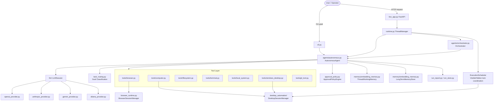

# Agentra Architecture

This page maps the runtime pieces that turn a goal into tool calls, UI updates, persisted artifacts, and workspace checkpoints.

See also [Policies](policies.md) for execution rules, [Interfaces](interfaces.md) for reference surfaces, [Artifacts](artifacts.md) for on-disk state, and [Audit & Gaps](audit.md) for known wrong-logic and architecture-debt signals.

## System Overview

Agentra has two main execution surfaces:

- `agentra run ...` for a direct CLI run.
- `agentra app` for the live operator UI backed by `FastAPI` and `ThreadManager`.

Both surfaces ultimately rely on the same core pieces:

- `AgentConfig` for environment-backed configuration.
- `AutonomousAgent` for the main ReAct loop.
- `BaseTool` implementations for browser, desktop, filesystem, terminal, local-system, and git actions.
- `DesktopSessionManager` for thread-scoped visible or hidden desktop execution surfaces.
- provider implementations under `agentra/llm/` for model access and embeddings.
- memory stores under `agentra/memory/`.
- reporting and persistence primitives in `RunReport`, `RunStore`, and `WorkspaceLedger`.

## Major Components

### `AgentConfig`

`agentra/config.py` is the runtime configuration root. It resolves `AGENTRA_*` environment variables, expands important paths, and applies provider and permission-mode defaults.

Important normalization rules:

- `permission_mode="full"` forces `browser_identity="chrome_profile"` and `browser_headless=False`.
- `browser_identity="chrome_profile"` also implies `permission_mode="full"`.
- workspace, working-memory, and long-term-memory paths are resolved to absolute paths.

### `AutonomousAgent`

`agentra/agents/autonomous.py` owns the single-agent execution loop.

Responsibilities:

- builds the system prompt and goal-specific guidance.
- starts an `LLMSession` with tool schemas.
- emits thought, tool call, tool result, screenshot, approval, question, done, and error events.
- applies tool guardrails before execution.
- writes observations into working memory and long-term memory.
- binds shared runtime services such as the execution scheduler, approval controller, and thread-scoped browser sessions.

### `Orchestrator`

`agentra/agents/orchestrator.py` is the multi-agent layer.

It:

- asks a planner model for a JSON sub-task plan.
- creates dependency-aware `SubTask` records.
- runs ready tasks in parallel with `asyncio.gather`.
- reuses `AutonomousAgent` instances by agent type.
- asks a summary model for the final synthesis.

The orchestrator does not introduce a second tool system; each sub-task still runs through the normal autonomous agent machinery.

Current risk: parallel sub-tasks with the same agent type share one cached `AutonomousAgent` instance. That can mix session state, tool state, memory writes, and browser or desktop resources. See [Audit & Gaps](audit.md).

### `ThreadManager`

`agentra/runtime.py` is the thread-aware runtime center.

It manages:

- thread creation and per-thread workspace layout.
- run creation, active-run tracking, and status transitions.
- pause and resume handoff state.
- approval requests, question requests, and manual human actions.
- event broadcasting for the live app.
- browser-session snapshots and live frame access.
- desktop-session snapshots and live frame access.
- thread snapshots, run snapshots, and persisted ledger state.

In the live app, `ThreadManager` is the primary runtime boundary between HTTP routes and agent execution. It also owns the thread-scoped browser and desktop session managers.

### `ExecutionScheduler`

`ExecutionScheduler` coordinates visible and hidden desktop work separately. Visible desktop control stays globally exclusive, while hidden desktop sessions can run concurrently with thread-scoped locking. Browser, filesystem, terminal, and other non-desktop capabilities do not share the same global lock.

This means Agentra can run multiple threads at once, can run multiple hidden desktop sessions in parallel, and still protects the real visible desktop from concurrent raw control.

### Browser Runtime

The browser stack is split across:

- `agentra/tools/browser.py` for the tool surface exposed to the model.
- `agentra/browser_runtime.py` for shared Playwright runtimes and thread-scoped browser sessions.

Key types:

- `BrowserRuntime` owns Playwright launch state.
- `BrowserSession` owns the active context and page state for one thread.
- `BrowserSessionManager` creates and reuses sessions, tracks browser defaults, and exposes live browser frame capture.

The browser runtime supports two identities:

- `isolated`
- `chrome_profile`

`chrome_profile` mode prepares a non-default launch clone of the user's Chrome profile and is used when permission mode is `full`.

### Desktop Session Runtime

The desktop stack is split across:

- `agentra/tools/computer.py` for raw desktop actions.
- `agentra/tools/windows_desktop.py` for structured Windows-native app automation.
- `agentra/desktop_automation/` for backend/session/capture/input implementations.
- `DesktopSessionManager` from `agentra/desktop_automation/session_manager.py`, imported by `agentra/runtime.py`, for thread-scoped visible or hidden desktop sessions.

Desktop execution modes:

- `desktop_visible`
- `desktop_native`
- `desktop_hidden`

`desktop_hidden` runs eligible local GUI work inside same-machine hidden desktop sessions and exposes those sessions through the existing live desktop preview routes. See [Hidden Desktop Workers](hidden-desktop-workers.md) for the subsystem details.

### Memory Stores

`agentra/memory/embedding_memory.py` provides disk-backed embedding memory.

Main layers:

- `ThreadWorkingMemory` stores thread-local observations.
- `LongTermMemoryStore` stores project-wide memories across runs and threads.

Each entry stores text, embedding, timestamp, optional screenshot path, metadata, and retrieval text. Both stores persist to disk and support semantic search.

### Workspace Management

`agentra/memory/workspace.py` owns the git-tracked workspace manager.

It:

- initializes a repository if possible.
- creates checkpoints with commit metadata and diff summaries.
- exposes history and restore helpers used by CLI workspace commands.

Threaded runs call into workspace checkpointing after a run finishes so that ledger audit entries can capture what changed.

### Reporting And Persistence

Reporting is split into two layers:

- `RunStore` writes structured run state to disk.
- `RunReport` wraps the store and renders the HTML timeline.

`RunStore` keeps:

- run metadata
- structured events
- frame metadata
- audit entries
- screenshot asset files

`RunReport` turns the snapshot into a standalone `index.html` page and updates it as new events arrive.

## Execution Paths

### Direct CLI Run

`agentra/cli.py -> run -> _async_run -> AutonomousAgent`

In this path:

- config comes from `AgentConfig` plus CLI overrides.
- `RunReport` writes into the configured workspace's `.runs/` directory.
- events are printed to the console through `_print_event`.
- no thread-aware live HTTP control layer is inserted.
- approval requests need a live `ThreadRuntimeController`; direct CLI runs currently do not pause on approval-policy decisions.

### Live App Run

`agentra/live_app.py -> FastAPI route -> ThreadManager.start_run -> ThreadManager._run_session -> AutonomousAgent`

In this path:

- a thread is created or reused.
- the thread gets isolated workspace and memory directories.
- a runtime controller is attached for pause/resume, approvals, and user questions.
- live routes can subscribe to SSE events or pull browser/desktop frames while the run is active.

## End-To-End Event Flow

A normal tool step looks like this:

1. The user starts a run from the CLI or the live app.
2. `AgentConfig` is resolved and the agent is created.
3. `AutonomousAgent` starts an LLM session with the system prompt, tool schemas, and relevant memory.
4. The model emits a thought or tool call.
5. Tool guardrails inspect the proposed tool call before execution.
6. In the live app path, `ApprovalPolicyEngine` converts sensitive steps into `approval_requested` events and waits for user input.
7. The tool runs and returns `ToolResult` data, including optional screenshots and metadata.
8. The agent writes observations into working memory and long-term memory.
9. `RunReport` and `RunStore` persist the event stream, frame data, and rendered HTML.
10. In the live app, `ThreadManager` broadcasts the stored event to subscribers and updates the thread ledger.
11. At run end, workspace checkpoint metadata is added to the thread audit trail.

## Runtime State Boundaries

Agentra keeps different kinds of state in different places:

- agent conversation state lives in the active `LLMSession`.
- thread lifecycle state lives in `ThreadSession` and `RunSession` objects.
- browser state lives in `BrowserSessionManager` and its sessions.
- persisted run state lives in `.runs/<run-id>/`.
- persisted thread state lives in `.threads/<thread-id>/ledger.json` and `audit.jsonl`.
- thread-local semantic memory lives in `.memory/` under the active workspace.
- project-wide long-term memory lives in `.memory-global/` under the base workspace.
- workspace file state lives in the git-tracked workspace directory.

## Current Architecture Debt

These are documented so contributors can remove or fix them deliberately instead of treating them as intended architecture:

- Goal routing logic is duplicated between `agentra/task_routing.py` and `agentra/agents/autonomous.py`. The routing module handles Turkish dotless `ı` normalization, while the local copy in the agent does not.
- The direct CLI and live app share `AutonomousAgent`, but only the live app binds the runtime controller required for approvals, questions, pause/resume, and manual actions.
- `WorkspaceManager` currently uses `git commit --allow-empty` for checkpoints, so a checkpoint may be reported as committed even when there were no file changes.

## Where To Look When Debugging

- Agent loop behavior: `agentra/agents/autonomous.py`
- Orchestration behavior: `agentra/agents/orchestrator.py`
- Thread lifecycle and HTTP snapshots: `agentra/runtime.py`
- Browser identity and Chrome profile behavior: `agentra/browser_runtime.py`
- Report rendering and run-store persistence: `agentra/run_report.py`, `agentra/run_store.py`
- Memory persistence and retrieval: `agentra/memory/embedding_memory.py`
- Workspace git checkpoints: `agentra/memory/workspace.py`

---

## Goal Routing & Task Classification Pipeline

`agentra/task_routing.py` implements the goal classification layer that translates a raw natural-language goal into a concrete `LiveExecutionPolicy`. This pipeline runs before any agent or tool is started.

### Classification Functions

| Function | Returns | Description |
|---|---|---|
| `goal_mentions_web_target` | `bool` | Detects URLs, domain patterns, or web-keyword presence |
| `goal_mentions_desktop_surface` | `bool` | Detects Windows paths (`C:\`), OneDrive, or desktop-surface keywords |
| `goal_requires_visual_desktop_control` | `bool` | Desktop surface + at least one visual action keyword |
| `goal_has_local_desktop_component` | `bool` | Desktop surface + any action, folder, document, or path keyword |
| `goal_has_mixed_web_and_local_desktop_components` | `bool` | Both web target and local desktop component detected |
| `goal_prefers_under_the_hood_local_execution` | `bool` | Explicit background hint or path-style open without visual preference |
| `goal_prefers_native_windows_desktop_execution` | `bool` | Local component + known Windows app profile + no pixel-level hints |
| `goal_prefers_visible_desktop_execution` | `bool` | Explicit visual terms like drag, right-click, canvas, or game |
| `goal_requests_real_browser_context` | `bool` | Personal account/profile/repo terminology |

### Policy Decision Tree

```
goal_has_local_desktop_component?
├── YES
│   ├── prefers_under_the_hood?
│   │   └── YES → mode=under_the_hood, desktop=hidden, fallback=pause_and_ask
│   ├── prefers_visible_desktop?
│   │   ├── prefers_native? → mode=native, desktop=native, fallback=visible_control
│   │   └── default         → mode=visible, desktop=visible, fallback=visible_control
│   ├── prefers_native?
│   │   └── YES → mode=native, desktop=hidden, fallback=pause_and_ask
│   └── default → mode=native or visible (mixed), desktop=hidden
└── NO → mode=visible, desktop=visible, fallback=visible_control (browser-only)
```

### Guardrail Patterns

Both `task_routing.py` and `autonomous.py` apply regex-based guardrail patterns before keyword matching to suppress false positives:

- **`_DESKTOP_GUARDRAIL_PATTERNS`** — suppresses phrases like "don't touch other windows/apps".
- **`_WEB_GUARDRAIL_PATTERNS`** — suppresses phrases like "without using the browser".
- **`_WEB_FALSE_POSITIVE_PATTERNS`** — suppresses phrases like "hesap makinesi" (calculator), which contains "hesap" (account).

> **Architecture debt:** Turkish dotless `ı` → `i` normalization (`stripped.replace("\u0131", "i")`) exists only in `task_routing.py`. The inline goal-analysis helpers duplicated inside `autonomous.py` lack this step, meaning routing decisions can differ between the two modules for Turkish input.

---

## Tool Layer Deep Dive

All tools inherit from `BaseTool` (`agentra/tools/base.py`) and return a uniform `ToolResult` object. The agent never calls OS APIs directly — it always goes through a tool.

### Tool Registry

| Tool module | Class | Primary capability |
|---|---|---|
| `tools/browser.py` | `BrowserTool` | Playwright web browser automation (navigate, click, type, extract, screenshot) |
| `tools/computer.py` | `ComputerTool` | Raw mouse/keyboard/screenshot on the visible desktop |
| `tools/filesystem.py` | `FilesystemTool` | Read, write, copy, move, delete files anywhere on disk |
| `tools/terminal.py` | `TerminalTool` | Shell command execution with timeout and output capture |
| `tools/local_system.py` | `LocalSystemTool` | Resolve known local folders; open confirmed local paths via OS default handler |
| `tools/windows_desktop.py` | `WindowsDesktopTool` | Structured Windows UI automation (launch app, click control, read text) |
| `tools/git_tool.py` | `GitTool` | Git operations on the agent workspace (status, add, commit, log) |
| `tools/visual_diff.py` | `VisualDiffTool` | Screenshot visual diff utility for change detection |

### Tool Selection Rules (baked into system prompt)

The system prompt enforces strict tool-routing rules so the model chooses the most appropriate surface:

1. `browser` — only for websites, web apps, and URLs.
2. `windows_desktop` — first choice for standard Windows GUI apps (Calculator, Notepad, Explorer, dialogs).
3. `local_system` — resolving and opening known local paths without GUI automation.
4. `computer` — only when visible on-screen interaction is genuinely required.
5. `filesystem` — preferred over `terminal` for local file inspection.
6. `terminal` — only when `filesystem` or `local_system` cannot resolve the task.

### Tool Guardrails

`AutonomousAgent` inspects every proposed tool call before execution through a set of behavioral guardrails. These include:

- **Repeated desktop click guard** — blocks the same `(x, y)` coordinate being clicked more than twice in six recent steps.
- **Repeated browser navigation guard** — blocks navigating to the same URL more than three times without an extraction step.
- **Excessive browser wandering guard** — interrupts long sequences of click/scroll/screenshot without any `get_text`, `get_html`, or `extract_links` call.
- **Failed dismissal-selector guard** — stops repeated attempts to click modal/popup close buttons after two failures.
- **Blank browser page guard** — detects `about:blank` or `data:,` page context before initiating sensitive steps.

---

## LLM Provider Abstraction Layer

`agentra/llm/` contains the provider abstraction so the agent core never depends on a specific model API.

### Class Hierarchy

```
LLMProvider (base.py)
├── OpenAIProvider     (openai_provider.py)   — OpenAI Chat Completions API
├── AnthropicProvider  (anthropic_provider.py) — Anthropic Messages API
├── GeminiProvider     (gemini_provider.py)   — Google GenAI SDK (google-genai)
└── OllamaProvider     (ollama_provider.py)   — Ollama local server
```

### Role-Specific Model Overrides

`AgentConfig` supports separate model names for specific reasoning roles, allowing cost and performance tuning without changing the main model:

| Config field | Default | Role |
|---|---|---|
| `llm_model` | `gpt-4o` | General reasoning + tool calls |
| `llm_vision_model` | _(same)_ | Screenshot interpretation |
| `executor_model` | _(same)_ | Interactive tool execution |
| `planner_model` | _(same)_ | Orchestrator planning pass |
| `summary_model` | _(same)_ | Final synthesis / summary |
| `embedding_model` | _(same)_ | Embedding generation for memory |

### LLMSession

Each agent run creates a fresh `LLMSession` that:

- holds the conversation history for one execution loop.
- sends tool schemas as part of the initial context.
- accumulates `thought`, `tool_call`, and `tool_result` turns.
- is discarded when the run finishes.

---

## Approval & Safety Layer

`agentra/approval_policy.py` implements a pluggable policy engine that converts sensitive tool calls into operator approval gates before execution.

### ApprovalPolicyEngine

The engine evaluates each proposed tool call against a configurable ruleset and emits one of three verdicts:

| Verdict | Meaning |
|---|---|
| `allow` | Proceed immediately |
| `approval_requested` | Pause run, broadcast event, wait for operator decision |
| `reject` | Block the action and return an error result |

### Sensitive Step Kinds

Two built-in helper functions detect browser sensitivity:

- **`browser_sensitive_input_kind`** — identifies authentication pages (login, OTP, 2FA, CAPTCHA), payment pages (checkout, credit card, CVV), and other credential entry points.
- **`browser_sensitive_takeover_kind`** — detects when the goal itself requests sensitive web entry (password, OTP, payment) and the browser has already navigated to a relevant page.

### Storage Redaction

The approval engine also applies storage redaction so that sensitive field values (API keys, passwords, card numbers) are not written verbatim into run events or audit files.

### CLI vs Live App

The approval engine is only fully wired in the live app path:

- **Live app** — `ThreadManager` attaches a `ThreadRuntimeController` that pauses the run, broadcasts the `approval_requested` SSE event, and waits for the operator's HTTP response.
- **CLI** — no runtime controller is attached. Approval-policy decisions are evaluated but cannot pause the run. This is a known architecture gap (see [Audit & Gaps](audit.md)).

---

## Configuration Normalization Rules

`AgentConfig` (`agentra/config.py`) enforces several cross-field normalization rules after all values are resolved from environment variables and `.env`:

| Trigger | Implied change |
|---|---|
| `permission_mode = "full"` | `browser_identity = "chrome_profile"`, `browser_headless = False` |
| `browser_identity = "chrome_profile"` | `permission_mode = "full"`, `browser_headless = False` |
| `llm_provider != "openai"` and `llm_model` still equals OpenAI default | `llm_model` reset to the chosen provider's default model |

Path fields (`workspace_dir`, `memory_dir`, `long_term_memory_dir`) are always resolved to absolute paths via `Path.expanduser().resolve()`.

---

## Component Interaction Diagram



---

## Concurrency & Thread Model

Agentra is built on Python `asyncio`. The following concurrency guarantees apply:

### Execution Scheduler

`ExecutionScheduler` (defined in `runtime.py`) manages two separate locking domains:

| Domain | Locking strategy | Rationale |
|---|---|---|
| Visible desktop (raw `computer` control) | **Global exclusive lock** | Only one thread may control the real visible desktop at a time |
| Hidden desktop sessions | **Per-session asyncio lock** | Multiple hidden desktop workers can run concurrently |
| Browser, filesystem, terminal | **No shared lock** | These capabilities are independently isolated per thread |

### Thread Lifecycle

Each live app thread (`ThreadSession`) follows this state machine:

```
created → idle → running → (paused → running)* → done / error / cancelled
```

State transitions are managed by `ThreadManager`. The `RunSession` records the active run within a thread and tracks the associated `asyncio.Task`.

### Orchestrator Parallelism

`Orchestrator` uses `asyncio.gather` to run independent sub-tasks concurrently. Sub-tasks with declared dependencies wait for their prerequisite sub-tasks to complete first. Each sub-task reuses a cached `AutonomousAgent` instance per agent type — this is the shared-session risk noted in [Current Architecture Debt](#current-architecture-debt).

---

## On-Disk State Layout

At runtime Agentra writes state to several locations under the configured workspace directory:

```
workspace/                         ← AGENTRA_WORKSPACE_DIR (git-tracked)
├── .git/                          ← Workspace git repository
├── .memory/                       ← AGENTRA_MEMORY_DIR — thread working memory
│   └── <thread-id>/
│       ├── embeddings.json
│       └── screenshots/
├── .memory-global/                ← AGENTRA_LONG_TERM_MEMORY_DIR — long-term memory
│   ├── embeddings.json
│   └── screenshots/
├── .threads/                      ← Thread ledgers and audit trails
│   └── <thread-id>/
│       ├── ledger.json            ← Thread metadata and run history
│       └── audit.jsonl            ← Append-only audit log
└── .runs/                         ← Run artifacts
    └── <run-id>/
        ├── events.jsonl           ← Structured event stream
        ├── frames/                ← Screenshot frame metadata
        ├── assets/                ← Screenshot image files
        └── index.html             ← Rendered HTML timeline (RunReport)
```

Each layer is independently readable. The HTML timeline can be opened in any browser without a running server.
